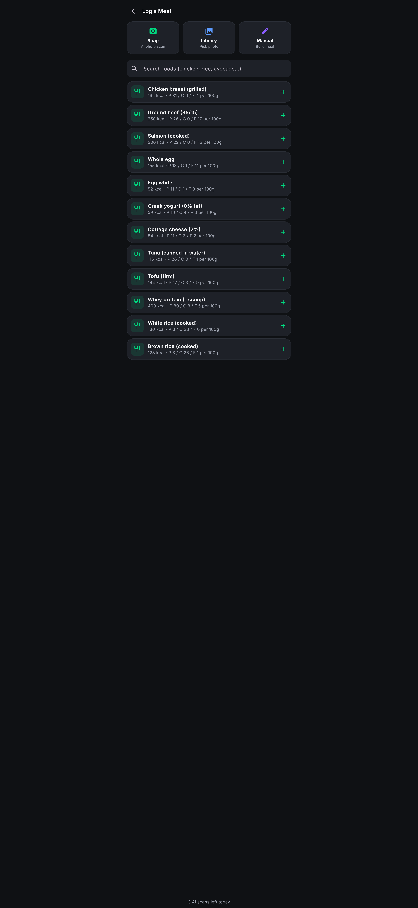
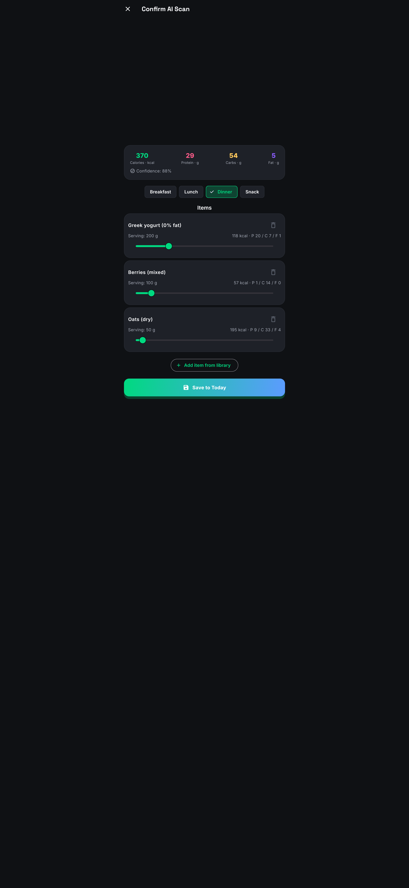
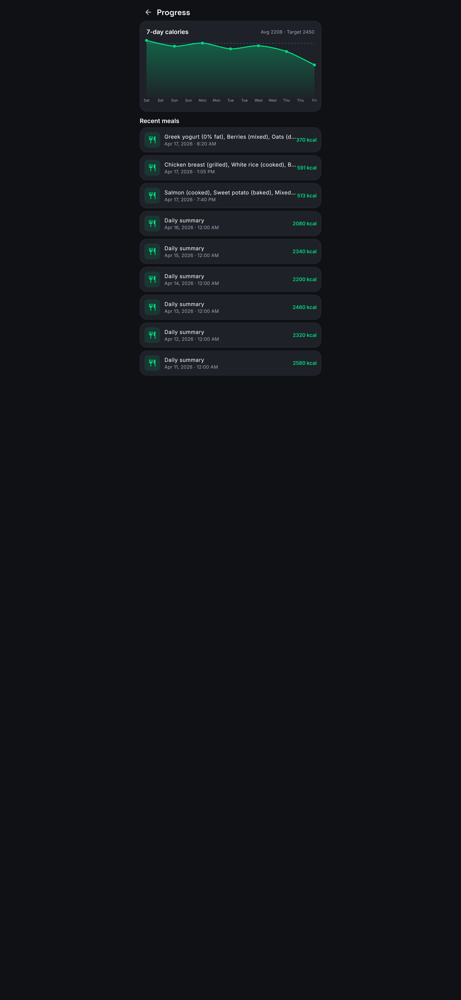
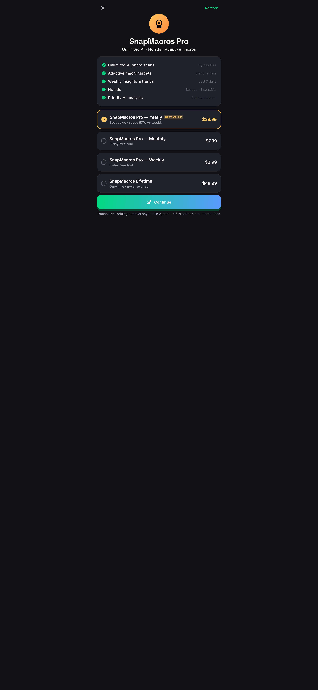

# SnapMacros — AI Food Macro & Calorie Tracker

> Snap a meal, get instant macros. Transparent pricing, no AI misidentification traps.

<p align="center">
  
</p>

<p align="center">
  
  
  
  
  
</p>

SnapMacros is a production-ready Flutter calorie / macro tracker that analyzes meal photos with Gemini 1.5 Flash (pluggable) and gives users a one-tap workflow to confirm and adjust portions — addressing the main frustrations users have with Cal AI, MacroFactor, and SnapCalorie.

## Competitive angle

| Competitor | Weakness | SnapMacros response |
|---|---|---|
| **Cal AI** | Hidden pricing until onboarding done · misidentifies food (Pink Lady apple → tikka masala) · bugs with streak tracking · premium for beta features | Pricing shown upfront; every AI result is **editable** with a tap-to-adjust UX; local nutrition DB fallback so you're never blocked; free tier includes 3 photo scans/day |
| **MacroFactor** | No free tier · expensive ($12/mo) · algorithm-only, no photo AI | Free tier with real features; photo AI + adaptive macros; yearly $29.99 (60% cheaper) |
| **SnapCalorie** | Requires a kitchen scale for accuracy | Multi-item AI + portion slider; no scale required |

## Key features

- **Snap a meal** — Gemini 1.5 Flash splits your plate into 1–6 items with grams + macros.
- **Trust, but verify** — every AI result opens the Confirm Meal screen where each item has a grams slider that rescales macros in real-time.
- **Offline fallback** — if no Gemini key is configured (or the API fails), SnapMacros returns a heuristic estimate + tells the user.
- **Local nutrition DB** — 40+ common foods, keyword search, swap in as meal items.
- **Adaptive macros** — Mifflin-St Jeor TDEE, automatic protein/carbs/fat split by goal (lose/recomp/maintain/gain).
- **7-day calorie trend chart** (fl_chart) with target overlay line.
- **Streak tracking** + daily scan-token reset at midnight.
- **Rewarded ads** unlock +1 photo scan.
- **IAP** — weekly ($3.99, 3-day trial) / monthly ($7.99, 7-day trial) / yearly ($29.99, best value) / lifetime ($49.99).

## Quick start

```bash
flutter pub get
flutter run --dart-define=GEMINI_API_KEY=YOUR_KEY   # optional for real AI analysis
```

Without a key the app still works — it returns a heuristic estimate and clearly tells the user.

## Regenerating store assets

```bash
flutter test --tags=screenshot test/screenshot_test.dart
flutter test --tags=assets test/generate_assets_test.dart
dart run flutter_launcher_icons
```

Screenshots land in `store_assets/ios/` and `store_assets/android/`, icon + feature graphic in `assets/icon/` and `store_assets/play/`.

## Store listings

- [`store/ios_listing.md`](store/ios_listing.md)
- [`store/android_listing.md`](store/android_listing.md)

## Deployment

See [`RELEASE.md`](RELEASE.md). Trigger a release:

```bash
git tag v1.0.0 && git push origin v1.0.0
```

## Pre-release checklist

- [ ] Add real `GEMINI_API_KEY` to Codemagic env var group `snapmacros_secrets`
- [ ] Replace AdMob test IDs
- [ ] Create App Store Connect + Play Console records + IAP products
- [ ] Host `PRIVACY.md` at a public URL
- [ ] Android keystore + `key.properties`
- [ ] Tag a release

## License

Proprietary — © Ideal AI.
